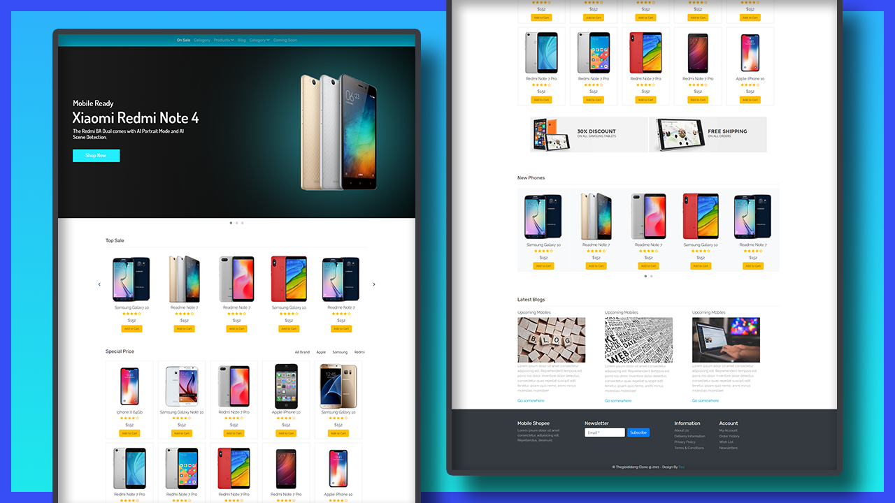
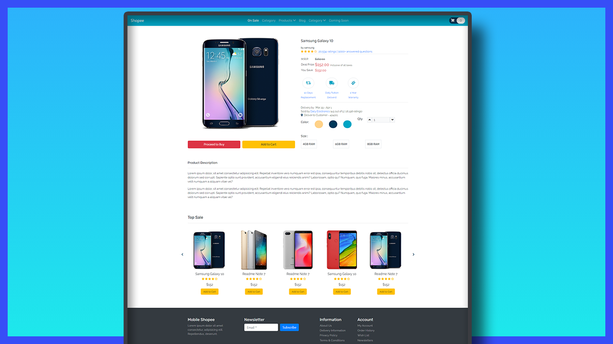

# Project: E-commerce Mobile Shopee Website

## Date: 12 - Jan - 21

### Functions

### Screenshot




### Deploy

- [Live Site](link)

### Tech-Stack

- HTML/CSS
- SASS
- PHP
- MySQL
- bootstrap v4.4
- font-awesome
- owl-carouse 2
- jquery
- jquery.isotope v3.0.6

### Explain technical:

- **bootstrap**: styles css
- **SASS**: modern CSS
- **owl-carouse**: Slider items
- **isotope**: filter products

### Directory Structure

```
.
├── .gitignore
├── package.json
├── README.md
├── public
└── src
    ├── App.js
    ├── App.css
    ├── index.css
    └── index.js
```

### Set up

1. Use the cmd to clone repo to your computer

```
git clone https://github.com/tinspham209/shopee-clone
```

2. cd to project folder

```
cd ./shopee-clone
```

3. Generate `style.css` from `.scss` file by this line:

```
npm start
```

4. Download extension: [Live Server](https://marketplace.visualstudio.com/items?itemName=ritwickdey.LiveServer) on VSCode
5. Open project with **Live server**

### Plan Of Action

- Initial project
- Install library: bootstrap, font-awesome, owl-carouse
- Initial project sass: variables, global style, colors
- Navbar
- Setup Owl Carousel
- Main site
  - Banner Main site
  - Top Sale
  - Special Price
  - Banner ads
  - New Phones
  - Blogs
  - Footer
- Product page
  - Product
  - Product price
  - Policy
  - order details
  - color
  - product qty section
  - size
  - product description
  - add function up & down product qty
- Cart page
  - Shopping cart section
  - shopping cart items
  - cart item
  - product rating
  - product qty
  - product price
  - subTotal section
  - input quantity
- Backend

### After this project

I have improve my knowledge about

- Review my HTML/CSS knowledge

I have understand about

- How to use bootstrap v4.4
- use owl-carousel to make slides of products
- use isotope for filter product by brand

Next Steps:
